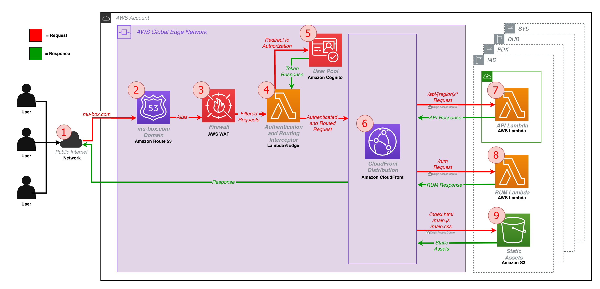
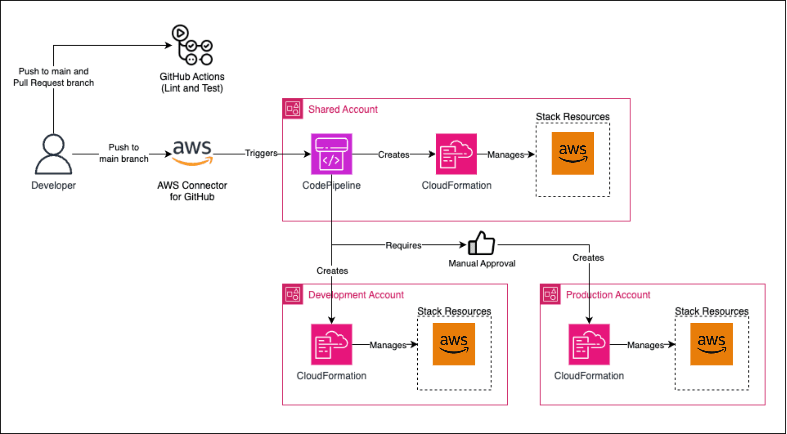

# MUBox

> **Note**  
> This repository is currently a prototype and not yet fully complete.  
> If you are interested in the project or contributing, feel free to reach out via email:  
> **louisgrennell@gmail.com**

---

# What is This? 🤔

MUBox is a platform designed to host **interactive educational tools** related to computer science and computational theory. Many topics in computer science benefit from experimentation rather than static examples. MUBox provides a shared platform where tools can be deployed and accessed or downloaded through a web browser, allowing users to explore computational models interactively. Each tool hosted on MUBox is implemented as a **modular application** within the repository and integrated into the platform interface. This allows tools to remain logically independent while sharing common infrastructure such as authentication, routing, observability, and deployment pipelines.

# Quick Start 🚀

After cloning the repository, run `npm i`.

To build, simply run `npm run build`.

To build for release, run `npm run build release`.

To spin up the development server, run `npm run start`.

# Development 💻

## Technologies 🛠

- **Node.js**: [Node.js](https://nodejs.org/) is an open-source, cross-platform, JavaScript runtime environment that executes JavaScript code outside of a browser and is built on Chrome's V8 JavaScript engine.

- **Nx**: [Nx](https://nx.dev/) is a a tool for managing Javascript projects with multiple packages within a single [monorepo](https://en.wikipedia.org/wiki/Monorepo). It is what allows us to have dedicated Node.js packages for each of our major components (i.e. api, cdk, and ui) within a single repository.

- **TypeScript**: [TypeScript](https://www.typescriptlang.org/) is an open-source programming language developed that is a strict syntactical superset of JavaScript that adds optional static typing to the language. TypeScript is designed for development of large applications and transpiles to JavaScript.

- **tRPC**: [tRPC](https://trpc.io/) is client/server framework for building full stack, type-safe applications by automatically generating REST-ful APIs with the query and mutation experience similar to that of GraphQL.

- **Vite**: [Vite](https://vitejs.dev/) is a build tool that aims to provide a faster and leaner development experience for modern web projects. The React team [no longer suggests using Create React App (CRA)](https://react.dev/learn/start-a-new-react-project#can-i-use-react-without-a-framework), thus this project has adopted Vite.

- **Vitest**: [Vitest](https://vitest.dev/) is a next generation JavaScript testing framework that comes fully loaded with all of thea features you need to write tests such as mocking, generating code coverage, generating snapshots, making assertions, and more.

- **ESLint**: [ESLint](https://eslint.org/) is a static code analysis tool for identifying problematic patterns found in JavaScript code and offers powerful features such as customization and automatic fixing.

- **Prettier**: [Prettier](https://prettier.io/) is an opinionated code formatter that enforces a consistent style.

- **React**: [React](https://reactjs.org/) is a declarative, component based JavaScript library for building user interfaces.

- **CloudScape**: [CloudScape](https://cloudscape.design/) is a set of React components that power the AWS website as well as many other internal websites.

## Packages 📦

All of the packages that power MUBox are contained in `/packages`. Below is a list of the packages and their role.

- `packages/ui` - Implements the MUBox web interface, including platform navigation, documentation pages, and hosted tool integration.

- `packages/api` - Provides backend API endpoints used by the platform and hosted tools.

- `packages/tsflap` - The first educational tool hosted on MUBox. 

- `packages/shared` - Contains shared utilities, type definitions, and reusable logic used across multiple packages.

- `packages/interceptor` - Implements authentication and request interception logic used at the platform edge.

- `packages/rum` - Provides ingestion and processing for **Real User Monitoring telemetry**.

- `packages/cdk` - Defines the cloud infrastructure required to deploy the MUBox platform.

## Scripts 📝

#### __Common Development__

MUBox is managed via Node, ensure you have v22 before proceeding.

- `npm run build` — Builds the workspace
- `npm run release` — Builds production artifacts
- `npm run start` — Starts the development server
- `npm run fix` — Automatically fixes most formatting and linting issues
- `npm run clean` — Cleans build artifacts
- `npm run test` — Runs tests
- `npm run test:watch` — Runs tests in watch mode

#### __Infrastructure (AWS CDK)__
MUBox infrastructure is deployed via a CDK Pipeline in an AWS Organization with IAM Identity Center. Before running the CDK commands you must authenticate with the CDK Pipeline AWS Account via AWS SSO.

- `aws sso login` - Retrieves and caches an AWS IAM Identity Center access token to exchange for AWS credentials.
- `npm run cdk bootstrap` — Bootstraps an AWS environment for CDK deployments
- `npm run cdk list` — Lists available stacks in the CDK application
- `npm run cdk diff <stack>` — Shows differences between deployed and local stacks
- `npm run cdk deploy <stack>` — Deploys the specified stack

#### __Nx Workspace__
Nx provides a visual representation of how applications and libraries within the workspace depend on each other.

- `npm run tasks:graph` - Launches an interactive dependency graph viewer. 

## Architecture 🏠

#### __MUBox Infrastructure__

#### __MUBox CI/CD__

# Contributing 💡

MUBox is designed to support the addition of new educational tools. Contributors can integrate new tools by implementing them as modular packages within the repository and registering them with the platform interface. Other typical contributions might include making improvements to existing tools, creating platform enhancements, or increasing the quality of existing and/or new documentation and/or reading materials. See the **Contribute** page within the platform documentation for full guidelines.

# Getting Help 🙋‍♂️

If you encounter issues or have questions either open an issue on GitHub or start a discussion in the repository.

# License 📜

This project is licensed under the **Apache License 2.0**.